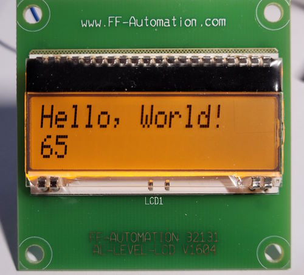
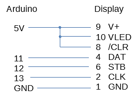

# EA DOGM162 display demo

This is a simple demo project for EA DOGM162 LCD display on FF-Automation custom board
found from Hacklab junk bin.

Schematic of the board is in schematic.pdf.

Display datasheet: 
https://www.mouser.fi/datasheet/2/127/dog_me-8076.pdf

Connections to Arduino:

Library used in the demo is modified from here:
https://github.com/matmunk/LiquidCrystal_74HC595

